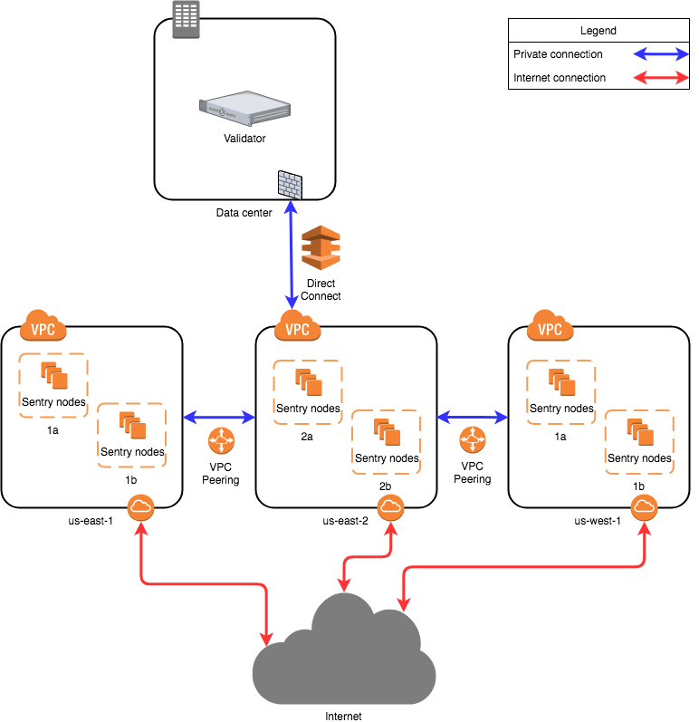

<!--
order: 3
-->

# Validator Security

Learn about sentry nodes and HSMs to secure a validator {synopsis}

Each validator candidate is encouraged to run its operations independently, as diverse setups increase the resilience of the network. Validator candidates should commence their setup phase now in order to be on time for launch.

## Horcrux

Horcrux is a [multi-party-computation (MPC)](https://en.wikipedia.org/wiki/Secure_multi-party_computation) signing service for Tendermint nodes

> Take your validator infrastructure to the next level of security and availability:
>
> - Composed of a cluster of signer nodes in place of the [remote signer](https://docs.tendermint.com/master/nodes/remote-signer.html), enabling High Availability (HA) for block signing through fault tolerance.
> - Secure your validator private key by splitting it across multiple private signer nodes using threshold Ed25519 signatures
> - Add security and availability without sacrificing block sign performance.

See documentation [here](https://github.com/strangelove-ventures/horcrux/blob/main/docs/migrating.md) to learn how to upgrade your validator infrastructure with Horcrux.

## Tendermint KMS

[Tendermint KMS](../kms/kms) is a signature service with support for Hardware Security Modules (HSMs), such as YubiHSM2 and Ledger Nano . It’s intended to be run alongside Cosmos Validators, ideally on separate physical hosts, providing defense-in-depth for online validator signing keys, double signing protection, and functioning as a central signing service that can be used when operating multiple validators in several Cosmos Zones.

For more details, please see [Tendermint KMS](../kms/kms.md)

## Hardware HSM

It is mission critical that an attacker cannot steal a validator's key. If this is possible, it puts the entire stake delegated to the compromised validator at risk. Hardware security modules are an important strategy for mitigating this risk.

HSM modules must support `ed25519` signatures for Haqq. The [YubiHSM 2](https://www.yubico.com/products/hardware-security-module/) supports `ed25519` and can be used with this YubiKey [library](https://github.com/iqlusioninc/yubihsm.rs).

::: danger
🚨 **IMPORTANT**: The YubiHSM can protect a private key but **cannot ensure** in a secure setting that it won't sign the same block twice.
:::

## Sentry Nodes (DDOS Protection)

Validators are responsible for ensuring that the network can sustain denial of service attacks.

One recommended way to mitigate these risks is for validators to carefully structure their network topology in a so-called sentry node architecture.

Validator nodes should only connect to full-nodes they trust because they operate them themselves or are run by other validators they know socially. A validator node will typically run in a data center. Most data centers provide direct links the networks of major cloud providers. The validator can use those links to connect to sentry nodes in the cloud. This shifts the burden of denial-of-service from the validator's node directly to its sentry nodes, and may require new sentry nodes be spun up or activated to mitigate attacks on existing ones.

Sentry nodes can be quickly spun up or change their IP addresses. Because the links to the sentry nodes are in private IP space, an internet based attacked cannot disturb them directly. This will ensure validator block proposals and votes always make it to the rest of the network.

When setting up a validator there are countless ways to configure your setup. This guide is aimed at showing one of them, the sentry node design. This design is mainly for DDOS prevention.

<br/>

### Network Layout

</br>
</br>



The diagram is based on AWS, other cloud providers will have similar solutions to design a solution. Running nodes is not limited to cloud providers, you can run nodes on bare metal systems as well. The architecture will be the same no matter which setup you decide to go with.

The proposed network diagram is similar to the classical backend/frontend separation of services in a corporate environment. The “backend” in this case is the private network of the validator in the data center. The data center network might involve multiple subnets, firewalls and redundancy devices, which is not detailed on this diagram. The important point is that the data center allows direct connectivity to the chosen cloud environment. Amazon AWS has “Direct Connect”, while Google Cloud has “Partner Interconnect”. This is a dedicated connection to the cloud provider (usually directly to your virtual private cloud instance in one of the regions).

All sentry nodes (the “frontend”) connect to the validator using this private connection. The validator does not have a public IP address to provide its services.

Amazon has multiple availability zones within a region. One can install sentry nodes in other regions too. In this case the second, third and further regions need to have a private connection to the validator node. This can be achieved by VPC Peering (“VPC Network Peering” in Google Cloud). In this case, the second, third and further region sentry nodes will be directed to the first region and through the direct connect to the data center, arriving to the validator.

A more persistent solution (not detailed on the diagram) is to have multiple direct connections to different regions from the data center. This way VPC Peering is not mandatory, although still beneficial for the sentry nodes. This overcomes the risk of depending on one region. It is more costly.

<br/>

### Local Configuration

<br/>
<br/>


The validator will only talk to the sentry that are provided, the sentry nodes will communicate to the validator via a secret connection and the rest of the network through a normal connection. The sentry nodes do have the option of communicating with each other as well.

::: tip
Read more about Sentry Nodes on the [forum](https://forum.cosmos.network/t/sentry-node-architecture-overview/454)
:::

To setup your sentry node architecture you can follow the instructions below:

Validators nodes should edit their `config.toml`:

```bash
# Comma separated list of nodes to keep persistent connections to
# Do not add private peers to this list if you don't want them advertised
persistent_peers =[list of sentry nodes]

# Set true to enable the peer-exchange reactor
pex = false
```

Sentry Nodes should edit their config.toml:

```bash
# Comma separated list of peer IDs to keep private (will not be gossiped to other peers)
# Example ID: 3e16af0cead27979e1fc3dac57d03df3c7a77acc@3.87.179.235:26656

private_peer_ids = "node_ids_of_private_peers"
```

## Environment Variables

By default, uppercase environment variables with the following prefixes will replace lowercase command-line flags:

- `EVMOS` (for Haqq flags)
- `TM` (for Tendermint flags)
- `BC` (for democli or basecli flags)

For example, the environment variable `HAQQ_CHAIN_ID` will map to the command line flag `--chain-id`. Note that while explicit command-line flags will take precedence over environment variables, environment variables will take precedence over any of your configuration files. For this reason, it's imperative that you lock down your environment such that any critical parameters are defined as flags on the binary or prevent modification of any environment variables.
